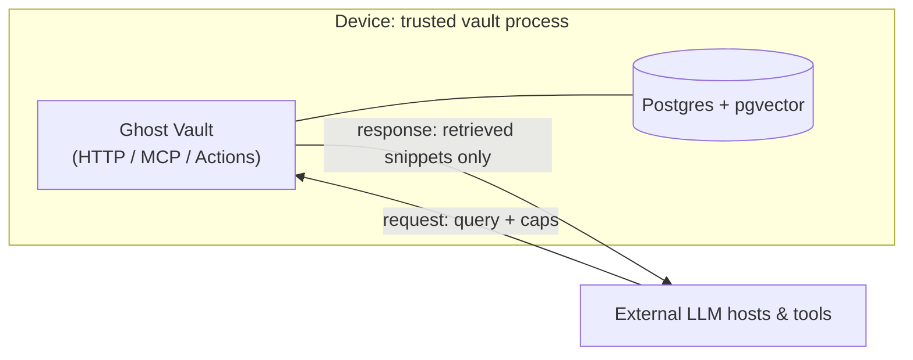
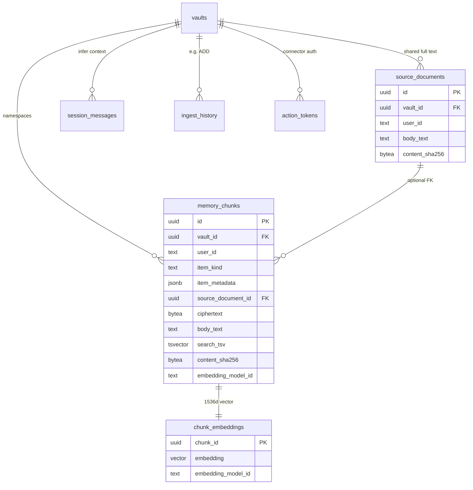
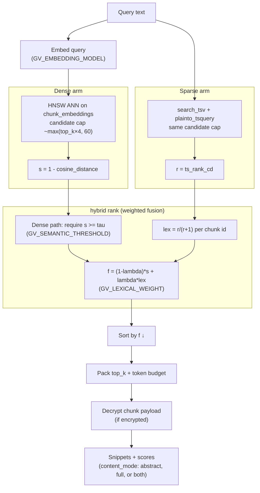

# Ghost Vault — product overview

**Ghost Vault** is a **user-held, encrypted memory layer** for LLM workflows. It runs **on the user’s device** (local trusted process) as the place where the vault **unlocks**, indexes, and retrieves: **hybrid search** (dense + sparse + filters + budgets). The implementation is **Go**, aligned with the [Ghost engine](https://github.com/Z-Ghostshell/ghost) stack.

**Plaintext boundary:** the **full corpus** exists in plaintext **only in that local process** while the vault is unlocked. **ChatGPT, Claude, Gemini, etc.** see **only the request payload** you send—query plus any retrieved snippets—not the whole database or disk.

**Relation to GitS:** [GitS / Ghost](../../gis/docs/design.md) is the multi-agent framework (in-engine memory in Postgres, knowledge, whisper, etc.). Ghost Vault is the **user-held vault** for **external** LLM hosts and tools (Actions, MCP, Gemini) over a **single HTTP API**. This doc is the **canonical** product overview for Ghost Vault; GitS `design.md` links here.

**Framing (soul–mind, for copy only):** the **mind** is the private, persistent memory (ciphertext at rest, unlock for session). The **soul** is identity and integrity under your keys. Optional **on-chain** anchors are **out of v1**; **authentication** may still use **wallet-style cryptographic lock-in** (e.g. MetaMask-class) where useful, without mandating a specific L1/L2 or on-chain signup record.

## What ships in scope

- **Local service** — HTTP/OpenAPI core on the device; durable store **encrypted at rest**; plaintext only after unlock in process.
- **Hybrid retrieval** — Dense embeddings (HNSW / cosine) plus **lexical** full-text (PostgreSQL `tsvector` / `ts_rank_cd` in v1), metadata filters, token/chunk budgets, deduplication across turns.
- **v1 integration order** — **ChatGPT first** (custom GPT **Actions** → your HTTPS API). Then **MCP** (Claude Desktop and peers), **Gemini** tools/API, and other connectors on the same API.
- **Client targets** — **Desktop first**; **mobile and browser** UIs for the same hosts are explicit **follow-ons**.
- **Custody UX** — **Desktop or browser extensions** (or other sidecars) **when needed** for keys or safer auth flows.
- **Deploy** — Docker Compose or bare binary on the machine that runs the vault; documented threat model and unlock flow.
- **Offline** — **Not** a v1 requirement (no need for full memory use without network except when calling a model).

## Storage, entity shape, embeddings, and tracking

**How each memory is stored (durable row model).** The unit of storage is one **memory chunk**: a row in `memory_chunks` plus a matching row in `chunk_embeddings`. The chunk row holds **namespace** (`vault_id`, `user_id`), optional **`item_kind`** and **`item_metadata` (JSONB)** for agent-supplied typing, **integrity** (`content_sha256` over normalized `kind+abstract+body` for structured rows), **versioning** (`embedding_model_id`, `chunk_schema_version` — 1 = legacy single string, 2 = JSON v2 with abstract and body), **lexical index** (`search_tsv` from **abstract and body** concatenated), and **payload** either **encrypted** (`ciphertext` + `nonce` + `key_id`) or **plaintext dev mode** (`body_text`) — never both. The logical record may hold a **short abstract** and a **long body**; the **dense embedding** is built from the abstract when it is non-empty, otherwise from the body (single vector per row). Vectors live **separately** in `chunk_embeddings` as a **1536-dimensional** `pgvector` column with an **HNSW** index under **cosine** ops. Auxiliary tables include **`vaults`** (unlock/crypto metadata), **`session_messages`** (recent turns for infer-time extraction), **`ingest_history`** (append events such as `ADD` per chunk), and **`action_tokens`** for connector auth.

**Entity types.** Rows are one physical type with optional `item_kind` and structured **abstract** vs **body** in the v2 JSON payload. The [data model note](./future/DATA-MODEL.md) lists **conceptual** kinds; connectors can set `item_kind` (e.g. `preference`, `article_segment`) and optional `metadata` for host-defined fields.

**Which embedding.** Ingest and retrieve both call the configured OpenAI-compatible **embeddings** API. Default model id is **`text-embedding-3-small`** (**1536** dimensions), overridable via `GV_EMBEDDING_MODEL`. Chunk rows record **`embedding_model_id`** so re-embedding or model changes do not silently mix incompatible vectors.

**How we track and deduplicate.** **Per-chunk** `content_sha256` plus namespace prevents duplicate facts on ingest: legacy text uses a hash of the normalized body string; structured rows use normalized **kind, abstract, and body**. **`created_at` / `deleted_at`** support lifecycle; **`ingest_history`** logs events tied to `vault_id` and `chunk_id`. Session text for **`infer`** flows through **`session_messages`** and is pruned after ingest.

**Ingest and retrieve control (agent-facing).** `POST /v1/ingest` accepts `items[]` or top-level `abstract` / `text` / `kind` / `metadata`, or legacy `text` with chunking. Optional **`source_document`** (`text`, optional `title`) stores **one** full document in `source_documents`; each `items[]` row with an **empty** `body`/`text` links that chunk to the shared blob via **`source_document_id`** (deduplicated by hash of the source bytes) so multiple retrievable slices do not duplicate the long form. `infer` is per request; `infer_target` is `abstract` (default) or `body` for where the model places each extracted string. `POST /v1/retrieve` takes optional **`content_mode`**: `auto` (default) returns the short **abstract** as `text` when present and sets **`full_available`** if a long body exists; `full` returns the body; `both` returns `text` (abstract) and **`full_text`**. The host can use **`GET /v1/chunks/{id}`** to load the full record (body in `text`, plus `abstract` / `kind` / `metadata`, and **`source_document_id`** when linked) — a small **two-stage** pattern: rank on abstracts, then expand by id when needed.

## Retrieval: algorithm, fusion score, and tuning knobs

**Retrieval pipeline (current implementation).** On `retrieve`, the service **embeds the query** with the **same** embedding model as chunks, then runs **two candidate pulls** in parallel: (1) **dense** — approximate nearest neighbors via **HNSW** on `chunk_embeddings`, ordering by **cosine distance** (`<=>` with `vector_cosine_ops`) and treating **semantic similarity** as one minus that distance; (2) **sparse** — PostgreSQL **full-text search** on `search_tsv` with **`plainto_tsquery('english', …)`** and **`ts_rank_cd`** as the raw lexical score. The engine **over-fetches** candidates (roughly `max(top_k × 4, 60)` from each channel) before fusion, then **packs** results into `top_k` and optional **token budget** using a simple character-based estimate.

**Ranking / fusion (name and behavior).** Final ordering uses a **hybrid rank**: apply a **semantic floor** (discard dense candidates whose semantic score is below a threshold), then a **linear weighted fusion** of semantic and **normalized** lexical scores. This is **not** reciprocal rank fusion (RRF) in the code today; [RETRIEVAL.md — Alternates and research](./future/RETRIEVAL.md#alternates-and-research) covers RRF and other non-shipped options.

**Equations.** Let \(d\) be the **cosine distance** between the query vector and the chunk vector from pgvector. Define the **semantic score** \(s = 1 - d\) (in \([0,1]\) for unit-normalized embeddings). Let \(r\) be the raw **`ts_rank_cd`** lexical score. Normalize lexical contribution to \([0,1)\) with

\[
\ell = \frac{r}{r + 1}.
\]

Let \(\tau\) be the **semantic threshold** (`GV_SEMANTIC_THRESHOLD`, default `0.25`) and \(\lambda\) the **lexical weight** (`GV_LEXICAL_WEIGHT`, default `0.35`). For chunks that appear in the dense candidate set and satisfy \(s \ge \tau\), the **fused score** is

\[
f = (1 - \lambda)\, s + \lambda\, \ell.
\]

Chunks are sorted by \(f\) **descending**. **Increasing** \(\lambda\) puts more weight on keyword/FTS overlap; **increasing** \(\tau\) drops more semantically weak dense hits before fusion. Lexical-only hits that never appear in the dense list are **not** currently promoted by this fusion path.

## Honest limits

- Whatever you **put in a model’s context** for a request is visible to **that** provider for that request (and subject to their logging/training policies).
- **Inference leakage** to the active LLM host is unavoidable for included snippets; the design targets **whole-database confidentiality** at rest on the device and **minimal** retrieval per turn.

## Deferred

**On-chain** DID/registry/commitments, persona/twin agent, encrypted backup/restore UX polish, **outsourced** trust-free indexing, and **product/legal** topics (jurisdictions, ingest consent model, revenue) are **out of the first vertical slice** unless pulled forward.

**Roadmap:** [ROADMAP.md](./ROADMAP.md). **Deeper technical notes:** [future/](./future/) (architecture, crypto, data model, retrieval, threat model, integrations).

## Doc index

Full map: [README.md](./README.md). **Unlock and Bearer security:** [UNLOCK-AND-BEARER.md](./UNLOCK-AND-BEARER.md).
